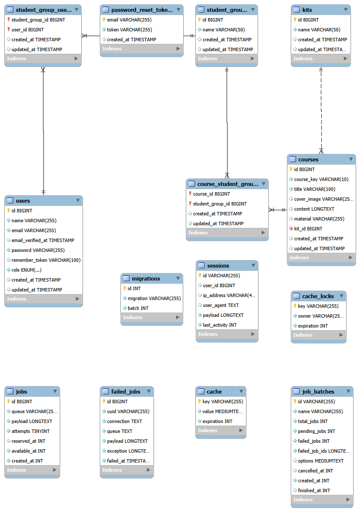

# Actividad 7 - sistema de gestion de escuela de robotica

## descripcion del proyecto
Este proyecto es un sistema de gestion para una escuela de robotica basado en Laravel, permite a la administración crear grupos de estudiantes, asignar cursos para los grupos, y permite a los estudiantes consultar sus cursos dentro de la plataforma

### STACK

- Laravel
- MySQL
- PHP

## Diagrama ER

### Entidades

| Entidad | Descripción |
|---|---|
| users | usuarios de la plataforma con sus respectivos roles: Admin, Profesor y Alumno |
| student_groups | Grupos de estudiantes: principiante, intermedio y avanzado |
| kits | kits de robotica requeridos por cada curso |
| courses | catalogo de cursos con contenido y materiales |
| course_student_groups | Asigna los cursos a su respectivo grupo de estudiantes (entidad "puente01") |
| student_group_users | Asigna estudiantes a los grupos (entidad "puente02") |

### Relaciones 
- A **USER** tiene un rol (Admin, Profesor, Alumno)
- A **USER** pertenece a uno o muchos **STUDENT_GROUPS**
- A **STUDENT_GROUP** puede tener muchos **COURSES**
- A **COURSE** pertenece a un **KIT**

### DIAGRAMA ER: 

